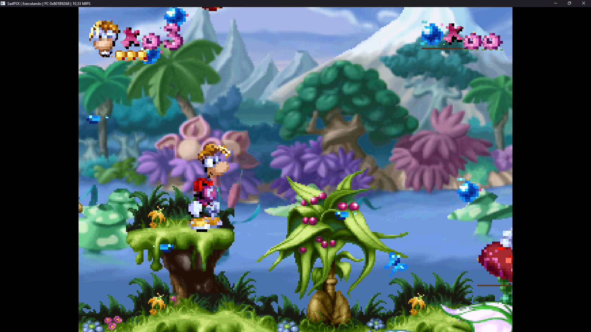

# SadPSX

<p align="center">
  
</p>

**English** | [Português (Brasil)](README.pt-BR.md)

SadPSX is an experimental PlayStation emulator written in C# and .NET 10.

The project prioritizes correctness, maintainable subsystem boundaries, and
diagnostics that make hardware behavior easier to understand. It is an early
beta: commercial software can boot and reach gameplay, but compatibility,
graphics, audio, and timing are still incomplete.

## Current Status

SadPSX currently provides:

- An interpreted MIPS R3000A CPU with delay slots, load delays, exceptions,
  COP0, interrupts, and unaligned memory operations.
- A GTE/COP2 implementation covering the geometry and lighting commands needed
  by early compatibility tests.
- A 1024×512 GPU VRAM, GP0 command parser, textured and Gouraud primitives,
  transfers, masking, dithering, and video timing.
- DMA channels for MDEC, GPU, CD-ROM, SPU, and OTC transfers.
- CD-ROM commands, IRQs, ISO9660 boot discovery, BIN/CUE images, and CD-DA
  playback.
- SPU voices with ADPCM, ADSR, mixing, and SDL3 audio output.
- MDEC RLE/IDCT decoding and DMA transfers.
- Digital controller input through keyboard or SDL3-compatible gamepads.
- A basic launcher for selecting BIOS and BIN/CUE files.
- An SDL3 video frontend and diagnostic console.

The SCPH-1001 BIOS reaches the console menu. Rayman has been tested through its
intro and into playable gameplay with a controller. This is not a compatibility
guarantee: visual corruption, imperfect audio, missing features, hangs, and
crashes are expected.

## Tested Games

Compatibility results describe specific test sessions, not guaranteed support
for every region, revision, or disc dump.

| Game | Status | Observed behavior |
| --- | --- | --- |
| Rayman | Playable | Boots through the BIOS, plays the opening sequence, reaches gameplay, and accepts SDL3 gamepad input. Graphics still contain visible accuracy problems and audio can stutter or play incorrectly. |

<p align="center">
  
</p>

<p align="center"><em>Rayman running in SadPSX during a compatibility test.</em></p>

## Implemented Components

### CPU

The interpreted R3000A implementation includes:

- Arithmetic operations with and without overflow.
- Logical operations, comparisons, and immediate or variable shifts.
- Multiplication and division with hardware-specific edge cases.
- Conditional branches, `J`, `JAL`, `JR`, and `JALR`.
- Branch delay slots and load delays.
- Loads and stores, including `LWL`, `LWR`, `SWL`, and `SWR`.
- `HI`, `LO`, and the hardwired `$zero` register.

### GTE/COP2

COP2 implements `MFC2`, `MTC2`, `CFC2`, `CTC2`, `LWC2`, and `SWC2`, including
load delays for transfers back to the CPU. The GTE provides data and control
register semantics, FIFOs, and the commands `RTPS`, `RTPT`, `NCLIP`, `OP`,
`MVMVA`, `SQR`, `AVSZ3`, `AVSZ4`, `NCS`, `NCT`, `NCCS`, `NCCT`, `NCDS`, and
`NCDT`.

### COP0

COP0 currently provides:

- Processor identification, control, and debug registers.
- Syscall, breakpoint, overflow, address, bus, and reserved-instruction
  exceptions.
- Branch-delay exception tracking through the `BD` flag.
- Exception vector selection through `SR.BEV`.
- `MFC0`, `MTC0`, and `RFE`.
- Per-register read and write permissions.
- A PlayStation-compatible R3000A `PRID`.
- Writable-state reset while preserving fixed register bits.
- Software interrupts and the hardware interrupt line through `CAUSE.bit10`.

### Interrupts

The interrupt controller implements `I_STAT` and `I_MASK`, including all eleven
sources, masking, acknowledge-by-writing-zero behavior, and IRQ propagation to
COP0. Delivery respects `SR.IEc`, COP0 interrupt masks, and branch delay slot
completion.

### Timers

The three root counters implement counter, mode, and target registers in
`0x1F801100-0x1F801128`, including:

- System clock and the Timer 2 divide-by-eight source.
- Reset on target or overflow.
- IRQ on target or overflow.
- One-shot, repeat, pulse, and toggle modes.
- Target and overflow flags cleared after reads.
- Basic synchronization with HBlank, VBlank, and dotclock.

### DMA

The DMA controller implements registers for all seven channels, `DPCR`, and
`DICR`, including priorities, master enable, completion flags, acknowledge, bus
error, and IRQ3. Functional paths currently include:

- DMA0 block transfers from RAM to MDEC.
- DMA1 block transfers from MDEC to RAM.
- Incremental DMA2 manual and block transfers between RAM and GPU, respecting
  direction, DREQ, busy state, and `MADR`/`BCR` updates.
- Incremental DMA2 linked-list processing for GP0 command lists.
- DMA3 block transfers from the CD-ROM FIFO to RAM.
- DMA4 block transfers between RAM and SPU.
- DMA6/OTC reverse ordering-table generation.
- 24-bit DMA addressing with RAM mirrors.

The PIO channel preserves its registers but does not execute transfers yet.

### CD-ROM

The CD-ROM controller implements register banks, FIFOs, IRQ2, status commands,
seeking, and reading. `ReadN` and `ReadS` continuously deliver sectors at
single or double speed through buffered `DataReady`, `DataEnd`, pause, and DMA3
behavior.

CUE images may describe multiple data and audio tracks used by `GetTN`, `GetTD`,
`GetlocL`, and `GetlocP`. `Init`, `GetID`, `SetSession`, `SeekL`, `SeekP`, and
`ReadTOC` model motor state, seeking, and delayed secondary responses. When a
disc is mounted, the ISO9660 reader locates `SYSTEM.CNF` and reports the boot
executable path, LBA, and size.

Command responses have a minimum controller latency so the BIOS cannot miss an
IRQ before preparing its asynchronous wait. `Play` advances CD-DA tracks at 75
sectors per second, sends stereo PCM to the SPU, and produces `INT4` when an
AutoPause track ends.

### GPU

The GPU implements `GP0/GPUREAD`, `GP1/GPUSTAT`, a 1024×512 16-bit VRAM, and a
GP0 packet parser used by both CPU writes and DMA2.

Implemented rendering paths include:

- VRAM fill and copy commands.
- CPU-to-VRAM and VRAM-to-CPU transfers.
- Flat, Gouraud, textured, and semi-transparent polygons.
- Flat and Gouraud lines and polylines.
- Flat and textured rectangles and sprites.
- 4-bit and 8-bit CLUT textures and 15-bit direct textures.
- Drawing-area clipping, drawing offsets, texture windows, and sprite flips.
- Per-pixel masking and texture transparency.
- Top-left polygon fill rules and 4×4 dithering for Gouraud shading and
  modulation.
- Physical primitive-size rejection and GPU ready bits coordinated with DMA2.

The video generator converts CPU clocks into the GPU clock domain, advances
NTSC or PAL scanlines, respects GP1 display ranges, updates the even/odd field
flag, raises IRQ0 at VBlank, and supplies dotclock and HBlank signals to the
root counters.

### SPU

The SPU preserves its MMIO registers, reflects `SPUCNT` mode in `SPUSTAT`,
provides 512 KiB of sound RAM, and accepts manual or DMA4 transfers.

Its 24 voices decode ADPCM blocks and implement pitch, loop, key on/off, ADSR,
and stereo volume. The mixer also receives CD-DA PCM and respects CD volume and
audio-enable controls. The frontend sends 44.1 kHz output to an SDL3 audio
stream.

### MDEC

The Macroblock Decoder accepts commands from the CPU or DMA0, loads
quantization and scale tables, and decodes RLE blocks through an IDCT.
Monochrome 4/8 bpp and color 15/24 bpp output is exposed through its FIFO and
can return to RAM through DMA1.

### Memory

The bus currently routes:

| Region | Physical address | Status |
| --- | --- | --- |
| Main RAM | `0x00000000-0x001FFFFF` | Implemented |
| RAM mirrors | `0x00200000-0x007FFFFF` | Implemented |
| Expansion Region 1 | `0x1F000000-0x1F7FFFFF` | Open-bus `0xFF` stub |
| Scratchpad | `0x1F800000-0x1F8003FF` | Implemented |
| I/O ports | `0x1F801000-0x1F801FFF` | Partial |
| Expansion Region 2 | `0x1F802000-0x1F803FFF` | BIOS POST; remaining area stubbed |
| BIOS ROM | `0x1FC00000-0x1FC7FFFF` | Implemented |
| Memory Control | `0x1F801000-0x1F801020`, `0x1F801060` | Implemented |
| SIO0 | `0x1F801040-0x1F80104F` | Digital controller, timing, and IRQ7 |
| Interrupt Control | `0x1F801070-0x1F801077` | Implemented |
| DMA | `0x1F801080-0x1F8010FF` | DMA0-DMA4 and DMA6 functional |
| Root Counters | `0x1F801100-0x1F801128` | Implemented |
| GPU ports | `0x1F801810-0x1F801817` | Functional GP0/GP1 and VRAM |
| MDEC | `0x1F801820-0x1F801827` | Commands, tables, RLE/IDCT, and FIFO |
| CD-ROM ports | `0x1F801800-0x1F801803` | Commands, FIFOs, IRQ2, and sectors |
| SPU registers | `0x1F801C00-0x1F801DFF` | Voices, ADPCM, ADSR, RAM, and DMA |
| Cache Control | `0xFFFE0130` | Register implemented |

Writes while the instruction cache is isolated cannot alter main RAM,
preserving code loaded by the BIOS during initialization.

### Timing

`Cycles` counts executed instructions. `ClockCycles` tracks approximate costs
for instruction fetches, loads, and stores while distinguishing cached and
uncached RAM, scratchpad, MMIO, Expansion 1, and BIOS accesses.

Devices implement `IClockedDevice` and are registered by `PsxMachine`, which
delivers elapsed cycles after every instruction. Video timing uses integer
accumulators to convert CPU clocks into NTSC or PAL clocks without
floating-point drift.

The model does not yet cover complete bus contention, instruction cache
behavior, or accurate internal timing for every instruction and transfer.

## Beta Download

The initial Windows package is built as a self-contained `win-x64` executable,
so users do not need to install the .NET runtime.

SadPSX does **not** include a BIOS or any game. You must provide:

- A legally dumped 512 KiB PlayStation BIOS.
- Legally obtained BIN/CUE disc images from media you own.

To build the package locally:

```powershell
powershell -ExecutionPolicy Bypass -File .\scripts\publish.ps1
```

The archive is created under `artifacts/releases/`.

## Running

From source:

```powershell
dotnet run -c Release --project SadPSX.Frontend -- `
  .\BiosPS1\SCPH1001.BIN `
  --disc .\GamesPS1\Game.cue
```

From the Windows release:

```powershell
.\SadPSX.exe .\SCPH1001.BIN --disc .\Game.cue
```

Double-clicking `SadPSX.exe` without arguments opens a small launcher. Select a
512 KiB BIOS, optionally select a `.cue` or `.bin` disc image, and press
**Start**. Command-line arguments remain available for development and
automation.

Controls:

- SDL3-compatible Xbox, PlayStation, and generic gamepads are detected while
  the emulator is running.
- Arrow keys: D-pad.
- `Z` / `X`: Cross / Circle.
- `A` / `S`: Square / Triangle.
- `Q` / `W`: L1 / R1; `E` / `D`: L2 / R2.
- `Enter`: Start; `Backspace`: Select.
- `Space`: Pause; `R`: Reset; `F11`: Fullscreen; `Esc`: Exit.

Diagnostic shortcuts:

- `F1`: General CPU, video, IRQ, CD-ROM, DMA, and MMIO state.
- `F2`: Current instruction and CPU registers.
- `F3`: Unhandled MMIO accesses.
- `F4`: Recent CPU exceptions.

Logs are written to the `Logs/` directory next to the executable.

Use `--batch N` to adjust how many instructions run between window event
polls. `--paused` starts with emulation paused, and `--frames N` limits the
number of presented frames for automated diagnostics.

## Building

Requirements:

- [.NET SDK 10](https://dotnet.microsoft.com/download)

Commands:

```powershell
dotnet build SadPSX.slnx
dotnet test SadPSX.slnx
```

The command-line diagnostic runner is also available:

```powershell
dotnet run -c Release --project SadPSX.Cli -- `
  .\BiosPS1\SCPH1001.BIN 1000000 --validate
```

Without an instruction count, the CLI executes 100 instructions. Use `--trace`
to print every executed instruction; otherwise, it retains only a rolling trace
shown at the end.

### Diagnostic CLI

The CLI supports breakpoints, checkpoints, simple loop detection, and MMIO
reports:

```powershell
dotnet run -c Release --project SadPSX.Cli -- `
  .\BiosPS1\SCPH1001.BIN 1000000 `
  --checkpoint 0xBFC00000 `
  --break-pc 0x80000080 `
  --break-memory 0x1F801060 `
  --loop-threshold 100000 `
  --mmio-log `
  --dump-registers
```

- `--break-pc` stops before executing the selected address.
- `--break-memory` stops after a data read or write at the selected address.
- `--checkpoint` records the first cycle that reaches a PC.
- `--loop-threshold` stops after a PC is visited too many times.
- `--mmio-log` prints initial MMIO accesses and a per-address summary.
- `--dump-registers` prints GPRs, `HI/LO`, PC, and COP0 registers.
- `--validate` runs a smoke test and summarizes clocks, PCs, MMIO, and
  exceptions.
- `--disc` mounts a BIN or CUE image for headless boot tests.
- `--stop-on-unexpected` stops at the first unexpected exception and prints the
  opcode, nearby memory, and registers.

Addresses accept decimal or hexadecimal notation with the `0x` prefix.

For a long Release-mode boot investigation:

```powershell
dotnet run -c Release --project SadPSX.Cli -- `
  .\BiosPS1\SCPH1001.BIN 600000000 `
  --disc ".\GamesPS1\Game\Game.cue" `
  --stop-on-unexpected
```

### Automated Validation

Build the project, run all tests, and validate one million BIOS instructions:

```powershell
powershell -ExecutionPolicy Bypass -File .\scripts\validate.ps1
```

Select another BIOS image or instruction count:

```powershell
powershell -ExecutionPolicy Bypass -File .\scripts\validate.ps1 `
  -BiosPath .\BiosPS1\SCPH1001.BIN `
  -Instructions 2000000
```

Use `-NoRestore` when dependencies are already available and the machine is
offline. Validation succeeds when the requested count completes without host
failure, reserved instruction, coprocessor-unusable exception, or bus error.
Emulated syscalls and other expected exceptions remain reported but do not
automatically fail validation.

## Tests

Run the complete suite with:

```powershell
dotnet test SadPSX.slnx
```

The tests cover:

- Instruction decoding, arithmetic, logic, shifts, branches, and jumps.
- Delay slots, load delays, multiplication, division, loads, and stores.
- Unaligned loads and stores at every byte offset.
- COP0 exceptions, registers, permissions, and interrupt delivery.
- COP2 transfers, GTE registers, FIFOs, and geometry commands.
- CPU cycle accounting and device synchronization.
- Root counters, targets, dividers, synchronization, and IRQ generation.
- GPU control handshakes, GP0 packets, VRAM transfers, and rasterization.
- NTSC/PAL timing, dotclock, HBlank, VBlank, and IRQ0.
- DMA0-DMA4 block transfers, DMA2 linked lists, DMA6/OTC, and IRQ3.
- MDEC tables, RLE, IDCT, output formats, and DMA0/1.
- SPU voices, ADPCM, pitch, ADSR, stereo mixing, and DMA4.
- CD-DA playback, AutoPause, `INT4`, and SPU mixing.
- SDL3 video, audio, gamepad input, and frontend behavior.
- SIO0 timing, digital controller protocol, IRQ7, and BIOS POST.
- Address translation, bus routing, RAM, scratchpad, BIOS, and open bus.
- Disassembly, tracing, validation reports, and complete MIPS test programs.

## Project Structure

```text
SadPSX/
├── SadPSX.Core/
│   ├── Cpu/          # R3000A, COP0, and instruction decoding
│   ├── Gte/          # COP2 and Geometry Transformation Engine
│   ├── Gpu/          # GPU commands, rasterization, VRAM, and video timing
│   ├── Memory/       # RAM, scratchpad, BIOS, and memory regions
│   ├── Bus/          # Address translation and MMIO routing
│   ├── Bios/         # BIOS ROM loading
│   ├── CdRom/        # Disc images, commands, sectors, and CD-DA
│   ├── Dma/          # DMA channels and controller
│   ├── Mdec/         # Macroblock decoder
│   ├── Timers/       # Root counters
│   ├── Interrupts/   # I_STAT, I_MASK, and IRQ sources
│   ├── Spu/          # Sound processing, voices, and sound RAM
│   ├── Controllers/  # SIO0, controllers, and future memory cards
│   ├── Debugging/    # Disassembly, tracing, and validation
│   └── PsxMachine.cs
├── SadPSX.Cli/       # Headless BIOS and disc diagnostic runner
├── SadPSX.Frontend/  # SDL3 video, audio, input, and interactive loop
├── SadPSX.Tests/
│   ├── Cpu/
│   ├── Memory/
│   ├── Gpu/
│   ├── Dma/
│   ├── Mdec/
│   ├── Gte/
│   └── Controllers/
├── BiosPS1/          # Local BIOS dumps, ignored by Git
├── GamesPS1/         # Local disc images, ignored by Git
├── docs/
│   ├── assets/       # Project logo and application icon
│   └── screenshots/  # Compatibility screenshots
├── scripts/          # Validation and release packaging
└── SadPSX.slnx
```

## Known Limitations

- No complete settings interface, persistent configuration, or game library.
- No speed synchronization or dedicated CPU thread.
- GPU rasterization and DMA/FIFO timing are not pixel- or cycle-perfect.
- DMA chopping, channel arbitration, bus contention, PIO transfers, and timing
  outside DMA2 are incomplete.
- GTE lighting/color commands and saturation behavior are not complete.
- Memory cards, DualShock, and analog controller protocols are missing.
- CD-ROM periodic `Play` reports, volume matrix, and XA-ADPCM are missing.
- SPU reverb, noise, pitch modulation, and envelope accuracy need further
  work.
- MDEC IDCT and FIFO timing need additional precision.
- Central timing, bus contention, and instruction cache behavior are
  approximate.

Other MMIO peripherals remain stubbed. Video timing covers the signals needed
by the BIOS and timers but approximates interlacing, half scanlines, and
physical PAL/NTSC clock differences.

## Roadmap

The planned accuracy blocks are:

1. Precise GPU rasterization, FIFO behavior, and DMA interaction.
2. Complete GTE commands, flags, saturation, and edge cases.
3. Memory cards, DualShock, and controller configuration.
4. Advanced SPU behavior and XA-ADPCM audio.
5. Precise MDEC output and FIFO timing.
6. Central event scheduling, bus contention, and timing accuracy.
7. Compatibility tests, regression diagnostics, and performance optimization.

See [CONTRIBUTING.md](CONTRIBUTING.md) before submitting changes.
Release history is documented in [CHANGELOG.md](CHANGELOG.md).

## Legal Notice

No Sony BIOS, game images, keys, or proprietary runtime assets are included.
Use only BIOS and disc images dumped legally from hardware and media you own.
Compatibility screenshots remain the property of their respective copyright
holders and are shown only to document emulator behavior.

SadPSX is an independent project and is not affiliated with, associated with,
authorized by, endorsed by, or in any way officially connected with Sony
Interactive Entertainment.

## License

SadPSX is licensed under the [MIT License](LICENSE). Distributed dependency
notices are listed in [THIRD_PARTY_NOTICES.md](THIRD_PARTY_NOTICES.md).
