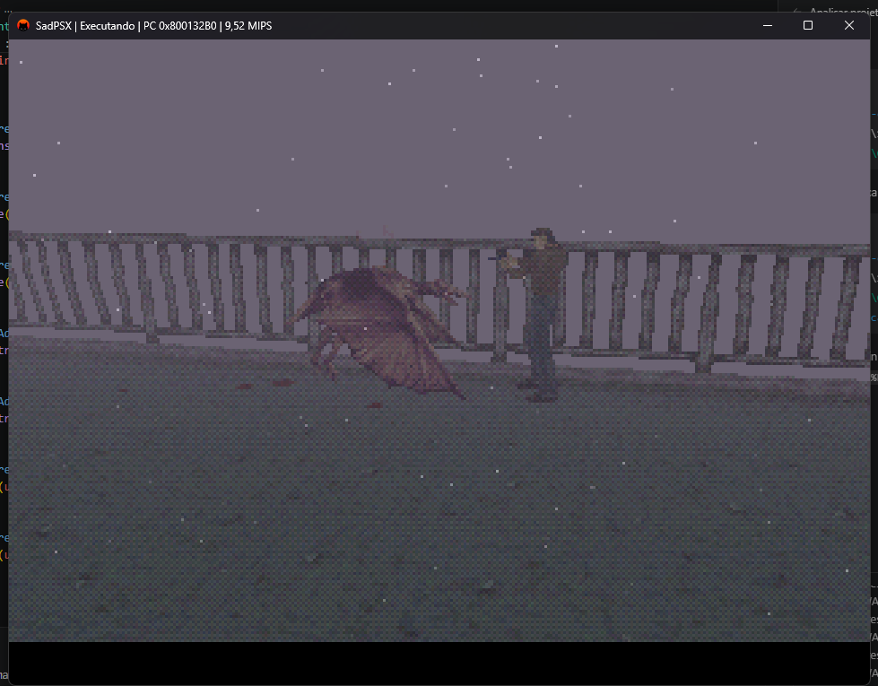
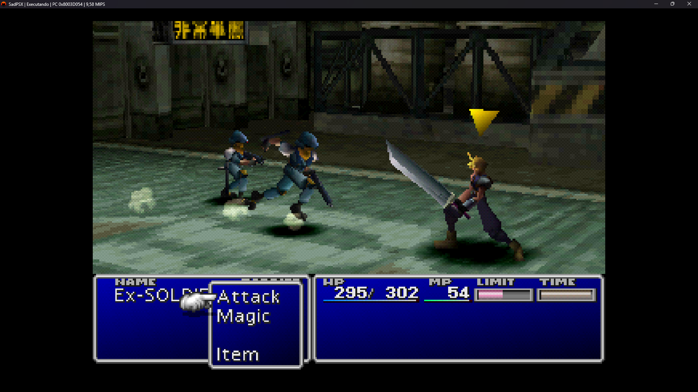

# SadPSX

<p align="center">
  
</p>

<p align="center">
  Um emulador experimental de PlayStation escrito em C# e .NET 10.
</p>

[English](README.md) | **Português (Brasil)**

O SadPSX é construído com subsistemas orientados ao hardware, temporização
determinística e diagnósticos que facilitam entender falhas de emulação. O
projeto ainda é uma beta inicial: alguns jogos comerciais chegam ao gameplay,
mas gráficos, áudio, desempenho e compatibilidade continuam incompletos.

Versão atual: **0.0.2-beta.1**.

## Estado atual

- A BIOS SCPH-1001 chega ao menu do console e exibe saves persistidos.
- Rayman e Silent Hill chegam a gameplay jogável.
- Final Fantasy VII chega ao gameplay e às batalhas.
- Controles digitais e analógicos funcionam por teclado ou gamepads SDL3.
- Memory cards raw de 128 KiB são persistidos automaticamente como `.mcr`.
- Discos BIN/CUE iniciam pela BIOS e pelo controlador de CD-ROM emulados.
- O dashboard em tela cheia possui biblioteca, capas, configurações, temas,
  remapeamento, histórico de jogo e animação de inicialização.

| Área | Estado |
| --- | --- |
| CPU, COP0 e GTE | R3000A interpretado com exceções, delays, interrupções e o conjunto documentado de comandos GTE |
| GPU e DMA | Rasterizador GP0 por software, VRAM de 1 MiB, transferências, FIFO, linked lists e arbitragem do barramento |
| CD-ROM e MDEC | Leitura BIN/CUE, boot ISO9660, caminhos CD-DA/XA, DMA e decodificação de vídeo por software |
| SPU | 24 vozes, ADPCM, ADSR, mixagem, noise, modulação, base de reverb e saída SDL3 |
| Entrada e armazenamento | Duas portas SIO0, controles digitais/analógicos, mapeamento SDL3 e memory cards persistentes |
| Timing e diagnóstico | Scheduler central por ciclos, root counters, IRQs, console, traces e testes automatizados |

Os detalhes ficam na [documentação técnica](docs/README.md).

## Compatibilidade

Os resultados representam sessões específicas de desenvolvimento e não
garantem todas as regiões, revisões ou imagens de disco.

| Jogo | Resultado | Principais problemas conhecidos |
| --- | --- | --- |
| Rayman | Jogável | Áudio e desempenho ainda são imprecisos; restam falhas de renderização |
| Silent Hill | Jogável | Sessões longas ainda precisam de regressão; o áudio continua impreciso |
| Final Fantasy VII | Gameplay e batalhas | Cores das FMVs e áudio estão imprecisos; persistência do save ainda não foi confirmada |

Consulte [COMPATIBILITY.md](docs/COMPATIBILITY.md) para o ambiente de teste,
procedimento de diagnóstico e regressões atuais.

<p align="center">
  
  
  
</p>

## Uso rápido

O SadPSX não inclui BIOS ou jogos de PlayStation. Use apenas dumps obtidos
legalmente de hardware e mídias que você possui.

### Build de lançamento

1. Baixe o arquivo para Windows em [GitHub Releases](https://github.com/kadu04t/SadPSX/releases).
2. Extraia e execute `SadPSX.exe`.
3. Selecione uma BIOS legal de 512 KiB.
4. Adicione uma pasta de jogos ou selecione uma imagem `.cue`/`.bin`.
5. Escolha um jogo no dashboard e inicie.

### Pelo repositório

Abra o dashboard:

```powershell
dotnet run -c Release --project SadPSX.Frontend
```

Inicie diretamente com BIOS e disco opcional:

```powershell
dotnet run -c Release --project SadPSX.Frontend -- `
  .\BiosPS1\SCPH1001.BIN --disc .\GamesPS1\Game.cue
```

O frontend de diagnóstico por terminal continua disponível em `SadPSX.Cli`.

## Controles padrão

| Teclado | Controle PlayStation |
| --- | --- |
| Setas | Direcional |
| `Z` / `X` | Cross / Circle |
| `A` / `S` | Square / Triangle |
| `Q` / `W` | L1 / R1 |
| `E` / `D` | L2 / R2 |
| `Enter` / `Backspace` | Start / Select |
| `Espaço` | Pausar ou continuar |
| `R` | Reiniciar console |
| `F1`-`F6` | Diagnósticos de execução |
| `F7` / `F8` | Trace MMIO / tipo de controle |
| `F11` | Alternar tela cheia |
| `Escape` | Voltar ao dashboard ou sair |

Controles compatíveis com SDL3 podem ser remapeados nas configurações.

## Compilação e testes

Requisitos:

- [.NET 10 SDK](https://dotnet.microsoft.com/download)
- Windows x64 para o pacote de lançamento disponibilizado
- Bibliotecas nativas SDL3 restauradas pelos pacotes do projeto

```powershell
dotnet restore SadPSX.slnx
dotnet build SadPSX.slnx -c Release
dotnet test SadPSX.Tests -c Release
```

Crie um pacote Windows autocontido:

```powershell
.\scripts\publish.ps1 -Version 0.0.2-beta.1 -Runtime win-x64
```

## Documentação

- [Índice técnico](docs/README.md)
- [Arquitetura e timing](docs/ARCHITECTURE.md)
- [CPU, COP0 e GTE](docs/CPU.md)
- [GPU e vídeo](docs/GPU.md)
- [SPU e áudio](docs/AUDIO.md)
- [CD-ROM, MDEC, DMA, timers, controles e armazenamento](docs/DEVICES.md)
- [Frontend](docs/FRONTEND.md)
- [Compatibilidade](docs/COMPATIBILITY.md)
- [Como contribuir](CONTRIBUTING.md)
- [Changelog](CHANGELOG.md)

## Estrutura

```text
SadPSX.Core/       Hardware emulado do PlayStation
SadPSX.Frontend/   Dashboard, vídeo, áudio e entrada SDL3
SadPSX.Cli/        Ferramentas de diagnóstico por terminal
SadPSX.Tests/      Testes unitários, de conformidade e regressão
SadPSX.Benchmarks/ Benchmarks reproduzíveis
docs/              Documentação técnica e compatibilidade
scripts/           Validação e empacotamento
```

## Limitações conhecidas

- Timing de áudio, reverb, reprodução XA e mixagem ainda precisam de precisão.
- O interpretador nem sempre mantém tempo real em todos os computadores.
- Rasterização da GPU e cores do MDEC ainda apresentam defeitos visíveis.
- A compatibilidade é limitada; jogos não testados podem travar ou não iniciar.
- Save states, debugger visual, netplay, conquistas e renderização por hardware
  ainda não estão implementados.

## Filosofia

O SadPSX é projetado para alta fidelidade ao hardware e limites claros entre
subsistemas. O ProjectPSX foi projetado principalmente para ser simples e
educativo; o SadPSX usa timing explícito, estado de hardware e diagnósticos como
fundação, continuando aberto e educativo.

## Aviso legal

PlayStation é uma marca da Sony Interactive Entertainment. O SadPSX é
independente e não possui afiliação ou aprovação da Sony. Nenhuma BIOS, jogo,
chave ou software protegido do console é distribuído.

## Licença

O SadPSX é licenciado sob a [GNU GPL v3](LICENSE).

O objetivo é permanecer aberto, educativo e colaborativo. Versões modificadas
distribuídas também devem permanecer abertas sob a GPL.
